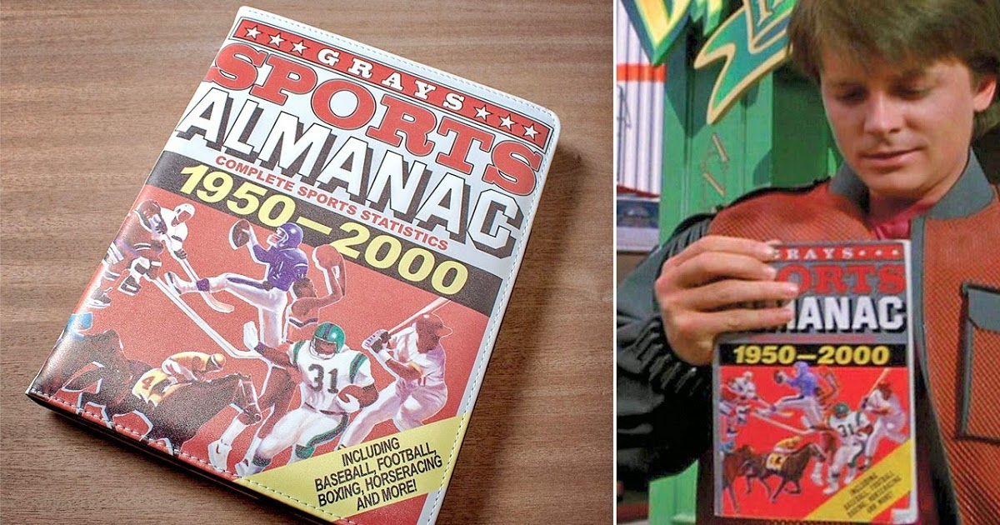
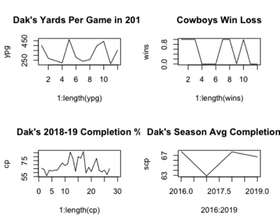

# NFL Time Series Modeling to Predict Betting Lines

If only we could predict the future of any future sporting event... We could be rich!

## Quick Start

1. Register for a 7 day free trial to (Pro Football API)[https://profootballapi.com/signup] to receive an API key.
2. Source this file and execute getPredictions('DAL','CHI') on the r command line

    getPredictions('DAL','CHI', 2019)

## Motivation

- To Win!
- Gamblers on average win between 53% and 55% of the time.
- Bettors make ~$93,000 a year

Even a +1%  can mean yield $$$ depending on bets made and amount wagered.  

## Traditional Sports Modeling

Traditional methods rely on moving averages

- Dak Prescott’s season completion% in 2016, 2018, and 2019 are within +/-1% of his career average.
- Players and Teams tend to revert to their mean

Vegas makes modifications to predictions for Home/Away, Weather, and Travel, etc to help improve these mean based predictions.  However, they are wrong 45 - 47% of the time.

## Cyclical patterns in Human Performance

- The wandering and cyclic behaviors evident in stats are a mirror into real life
- Good players have a higher mean than average players
- When all players on a team have a good game, that can raise the expectation of the team winning

## Stationary Time Series

Football statistics resemble a stationary time series.

- Mean and variance do not dependent on time
- Correlation of two points `t1 and t2` depends only on how far apart and not where they are in the time series.

Thus the conditions of stationarity are generally met.

## Theory

**Given**

- Player performances waver naturally
- Team performances are linear combinations of players’ performances
- Performance time seris statistics exhibit properties of a stationary time series

**Thus**

- A time series model is appropriate
- Individual performance cycles can be modeled and averaged together to predict team performance
- Comparing the prediction against a prediction from the opposing team should predict the winner and the margin of victory

**Process**

- Model each team as a stationary time series to predict score
- Difference the predictions to obtain the margin of victory
- Win millions

## Challenges

- Teams change composition year over year.
- Teams can go from being very horrible to very good. 2018-2019 49ers
- Or go the other way
- Team stats are short time series

We use team statistics as a proxy for individual performances in this study, and thus since team composition varies season to season, data across seasons isn't an ideal combination of player and coach performances.

There have been a number of techniques proposed and for modeling short time series. 
- Composite forecasts
- Non linear models such as Threshold Autoregressive and Neural Networks
- Modeling by analogy
- Domain knowledge to aid in feature engineering

In this study we use the modeling by analogy approach.  We assume without proof, that teams year over year, do not change signifigantly enough to affect our models.  This is of coure false in some situations, but it might be an appropriate approach for the majority of teams in NFL.  That is, good teams tend to stay good, and bad teams tend to stay bad barring a signifigant impact player leaving the team.

A better approach and an idea for future research is to model individual player and coaches performances and then combine these using mean,mode,neural network, etc to derive team performances. 

This might be a more accurate approach that could more appropriately be used across season boundries. This proposed model has the potential benefit of capturing an individual's natural cycles into the model.

## Data

I pulled the data from profootballapi.com using r to query API. I eliminated some columns not pertaining to my models.  I also created a few calculated columns to simplify some parameters, and I added lags of total yards, punt yards, penalty yards, and turnovers oto the model.

**Sample Data**

|     opponent    |     totfd    |     totyds    |     pyds    |     ryds    |     pen    |     penyds    |     trnovr    |     pt    |     ptyds    |     ptavg    |     week    |     gamedate      |     won    |     score    |
|-----------------|-------------:|--------------:|------------:|------------:|-----------:|--------------:|--------------:|----------:|-------------:|-------------:|------------:|-------------------|-----------:|-------------:|
|     MIA         |        31    |        643    |      378    |      265    |       4    |         40    |          0    |      1    |        56    |        56    |        1    |     2019-09-08    |       1    |        59    |
|     ARI         |        26    |        440    |      258    |      182    |      10    |         62    |          0    |      3    |       129    |        43    |        2    |     2019-09-15    |       1    |        23    |
|     KC          |        29    |        452    |      249    |      203    |       7    |         60    |          0    |      3    |       153    |        41    |        3    |     2019-09-22    |       0    |        28    |
|     CLE         |        24    |        395    |      222    |      173    |       3    |         15    |          3    |      3    |       131    |        44    |        4    |     2019-09-29    |       0    |        25    |
|     PIT         |        22    |        277    |      139    |      138    |      11    |         92    |          3    |      3    |       155    |        41    |        5    |     2019-10-06    |       1    |        26    |
|     CIN         |        26    |        497    |      228    |      269    |      10    |         81    |          1    |      2    |        84    |        32    |        6    |     2019-10-13    |       1    |        23    |

## Regressors

Depending on the teams there were varying levels of cross correlation between some of the more interesting regression parameter candidates 
For instance turnovers, total yards, penalties, and punt yards seemed to have more lagging effect than others.
Intuition states that if a team is high on turnovers one week, coaches and players would be extra cautious in preventing turnovers the next week.
Cross Correlation Plots varied from team to team, and thus domain knowledge augmented analysis in selecting parameters for the model.

## ARIMA Model

I began with a classic time domain approach using an Autoregressive Integrated Moving Average (ARIMA) model.
I chose a list of regressors that seemed to have significance across a broad range of teams, although individually
these regressors may or may not be appropriate for every team model.

Due to the short time series data horizon, variations in the data are nearly indistinguishable from noise

Regressors :

- Total yards and lag1
- Turnovers and lag1
- Penalty yards and lag1
- Punt yards and lag1

## MLP Model

I built a simple Multi-layer Percepteron (MLP) Neural Network with lagged inputs in my second model.
I intentionally chose a model that would overfit due to the short time series. Adding capacity with 
noisy data can help to tease out some underlying patterns. However you risk modeling noise.

Forced lags of 1 to keep consistent. However, I placed an option in the method to allow the mlp routine
to choose the lags. I also allowed the MLP routine freedom to exclude regressors showing no significance.

Regressors :

- Total yards and lag1
- Turnovers and lag1
- Penalty yards and lag1
- Punt yards and lag1

## VAR Model

In my thrid model I built a stochastic Vector Autoregressive (VAR) model to help capture the relationship between stats
as they change over time.  The method returns team predictions, their difference (the line), their sum (over under), 
and ASE based upon a leave one out approach. The VAR OLS algorithm picks the lags. 

Regressors :

- Total yards 
- Turnovers 
- Penalty yards 
- Punt yards 

## Ensemble Model

In this model I simply averaged the results of the ARIMA, MLP, and VAR models.

## Results

In this research I used an upcoming game, the matchup between my hometown Dallas Cowboys and the Chicago Bears in Week 14 of the 2019 season. 
I compared the Vegas lines, which use traditional linear mean analysis, with my time series difference approach, before and after the game was played.

### Vegas

- Vegas had DAL as a -2.5 road favorite. They ended up losing by 7.
- The over under was predicted to be 43.5. The actual was 55
- The money line settled at -150 for DAL. CHI ended up winning.

### Time Series Models

- Each TS model would have won on the money line predicting CHI to win
- Each TS model would have won on the over under, predicting over.
- Each TS model would have won against the spread predicting Chicago to win.

|     Model       |     Team   1    |     Team   1 Prediction    |     Team   2    |     Team   2 Prediction    |      Line    |     O/U    |       ASE   T1    |        ASE   T2    |
|-----------------|-----------------|---------------------------:|-----------------|---------------------------:|-------------:|-----------:|------------------:|-------------------:|
|     ARIMA       |     DAL         |                27.17111    |     CHI         |                29.09288    |      -2.0    |      56    |      26.740406    |      16.7516459    |
|     VAR         |     DAL         |                19.97455    |     CHI         |                35.51342    |     -15.5    |      55    |       4.102442    |     110.5319333    |
|     MLP         |     DAL         |                20.82924    |     CHI         |                24.03729    |      -3.0    |      45    |     230.151950    |       0.0013904    |
|     Ensemble    |     DAL         |                22.65830    |     CHI         |                29.54786    |      -7.0    |      52    |     260.994798    |     127.2849696    |

## Conclusion

The results of this experiment suggest that a time series modeling approach to predicting the outcome of sporting events seems to
be an approptiate modleing technique when compared in juxtaposition with another team and then differencing their relative performances.

This technique could be expanded to other sports, and it could also be used to enhance game planning and coaching.  For instance,
a player like Jimmy Butler who just played with teh Heat in the 2020 NBA finals, can go for 40 in a game, but he has proven over his carrer that 
be doesn't do it everynight.  Therfore, as a coach, if you know he was about to be in a down cycle you could use that knowedge to run plays for 
other teammates who could potentially be on the upswing that day.  Likewise on defense, if you know that you are about to face an opponent sheduled to be on a down cycle, then you could adjust your defensive to attack his or her weaknesses.

There is a lot of potential to this type of analysis, all over sport, outside of betting, and future researchers should take advantage of the possibilities 
exposed by this research.